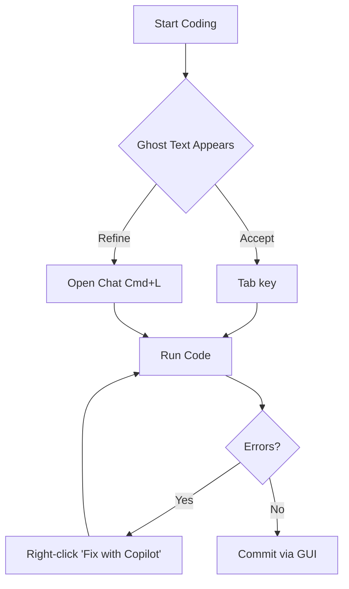
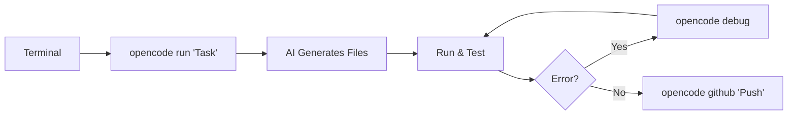

# Development Workflow Comparison: VS Code + Copilot vs. OpenCode CLI + NVIDIA Cloud LLM

This document compares two modern AI-assisted development workflows: the GUI-centric experience of **VS Code with GitHub Copilot** and the terminal-first approach of **OpenCode CLI configured with NVIDIA Cloud LLMs**.

---

## Comparison Overview

| Feature              | VS Code + GitHub Copilot                 | OpenCode CLI + NVIDIA Cloud LLM       |
|----------------------|------------------------------------------|---------------------------------------|
| **Primary Interface** | Graphical User Interface (IDE)           | Command Line Interface (Terminal/TUI) |
| **Model Hosting**    | GitHub / OpenAI Managed                  | NVIDIA Cloud Functions / Multi-model  |
| **Workflow Focus**   | Integrated, "While-You-Type" Assistance | Task-Oriented, Automated Executions   |
## 📊 Visualizing the Workflows

### VS Code + Copilot: The "Pair Programmer" Loop
For junior devs, this feels like having a senior engineer looking over your shoulder.



### OpenCode CLI: The "Automation" Loop
This is perfect if you love the terminal and want to automate the "boring stuff."



---

## 🛠 1. Creating Projects & Code

### VS Code + GitHub Copilot
- **Experience:** Inline autocomplete (Ghost Text) and Chat View (`Cmd+I` or `Cmd+L`).
- **Mechanism:** Suggests code snippets based on file context and open tabs.
- **Strength:** Excellent for discovery and small logic increments within a sprawling UI.

### OpenCode CLI + NVIDIA Cloud LLM
- **Experience:** Driven by `opencode run "message"` or the `opencode [project]` TUI.
- **Mechanism:** Uses high-throughput NVIDIA-hosted models (e.g., `llama-3.1-nemotron-70b-instruct`) via the `auth.json` provider config.
- **Example Command:**
  ```bash
  opencode run "Create a FastAPI project structure with a health check endpoint"
  ```
- **Strength:** Faster project scaffolding and mass-file generation without opening an IDE.

---

## 2. Debugging & Troubleshooting

### VS Code + GitHub Copilot
- **Experience:** Right-click context menus ("Fix this"), Chat-assisted error explanation, and integrated terminal analysis.
- **Workflow:** Relies on the user highlighting code or Copilot reading the "Problems" tab.

### OpenCode CLI + NVIDIA Cloud LLM
- **Experience:** Direct terminal interaction with the `opencode debug` command.
- **Workflow:** The CLI can automatically ingest terminal error outputs and standard streams to suggest fixes.
- **Example Command:**
  ```bash
  python app.py 2>&1 | opencode run "Fix the error in this output"
  ```
- **Strength:** Tight loop between execution failure and AI resolution within the same shell environment.

---

## 3. Pushing to GitHub

### VS Code + GitHub Copilot
- **Experience:** Integrated Source Control tab using the GUI. Copilot can generate commit messages based on staged changes.
- **Workflow:** "Stage -> Generate Message -> Commit -> Push" via buttons.

### OpenCode CLI + NVIDIA Cloud LLM
- **Experience:** The `opencode github` and `opencode pr` commands.
- **Workflow:** Automates the creation of branches, PRs, and commits directly.
- **Example Command:**
  ```bash
  opencode github "Stage everything and create a PR to main with a summary of changes"
  ```
- **Strength:** Power-user automation; handles the "Git plumbing" via natural language.

---

## Summary: Which to Choose?

- **Choose VS Code + Copilot** if you prefer a visual, interactive environment where AI acts as a pair programmer sitting next to you.
- **Choose OpenCode CLI + NVIDIA** if you are a terminal-centric developer who wants to leverage high-performance NVIDIA models for rapid project automation and Git management.
