## SDLC


# **Adding Software Development Lifecycle (SDLC) Concepts for Educators**

This section can be added after the “Understanding the Development Workflow” section to help educators connect classroom coding activities to real-world IT industry practices.

------

# **3. Understanding the Software Development Lifecycle (SDLC)**

Many educators new to coding assume software development is simply:

“writing code.”

In reality, professional software engineering involves a structured process called the:

# **Software Development Lifecycle (SDLC)**

The SDLC helps teams:

- Organize work
- Reduce errors
- Improve collaboration
- Deliver reliable software
- Maintain systems over time

AI-assisted coding tools support EVERY stage of this lifecycle.

------

# **The Big Picture**

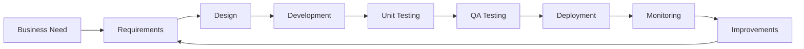

This cycle continuously repeats in real companies.

------

# **Explaining the SDLC in Teacher-Friendly Language**

| **SDLC Stage** | **Simple Explanation**       | **Student-Friendly Translation** |
| -------------- | ---------------------------- | -------------------------------- |
| Business Need  | What problem are we solving? | “Why are we building this?”      |
| Requirements   | What should the software do? | “What features are needed?”      |
| Design         | Planning the solution        | “Draw before building”           |
| Development    | Writing the code             | “Build the software”             |
| Unit Testing   | Testing small pieces         | “Check each function works”      |
| QA Testing     | Testing the whole app        | “Try to break the system”        |
| Deployment     | Releasing software           | “Put the app online”             |
| Monitoring     | Watching real usage          | “See what works or fails”        |

------

# **3.1 Business Requirements Understanding**

Professional software projects begin BEFORE coding.

The first question is:

“What problem are we trying to solve?”

------

## **Example for Educators**

Instead of:

“Build a school app”

A better business requirement is:

“Teachers need a faster way to track student attendance digitally.”

------

# **Requirements Discovery Workflow**

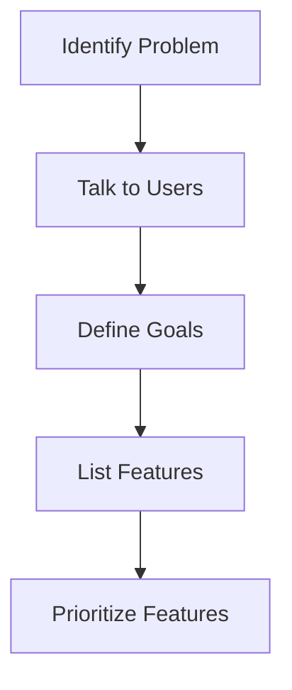

------

# **Classroom Activity Idea**

Ask students:

- Who is the user?
- What problem exists?
- What would success look like?

This teaches:

- Empathy
- Communication
- Product thinking

—not just coding.

------

# **3.2 Design Phase**

Before developers write code, they usually create:

- Diagrams
- Mockups
- Data plans
- User workflows

------

# **Simple Design Workflow**

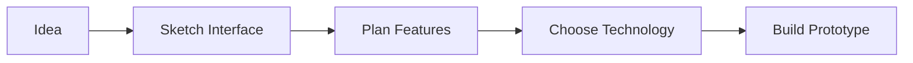

------

# **Teacher-Friendly Analogy**

Software design is like:

- An architect designing a house blueprint
- Before construction begins

Without design:

- Projects become messy
- Teams become confused
- Bugs increase

------

# **AI’s Role in Design**

AI can help students:

- Brainstorm app ideas
- Generate wireframes
- Suggest database structures
- Explain architecture concepts

------

# **3.3 Development Phase**

This is the stage most people think of as “coding.”

Students:

- Write code
- Generate code with AI
- Build features
- Connect components

------

# **Modern Development Workflow**

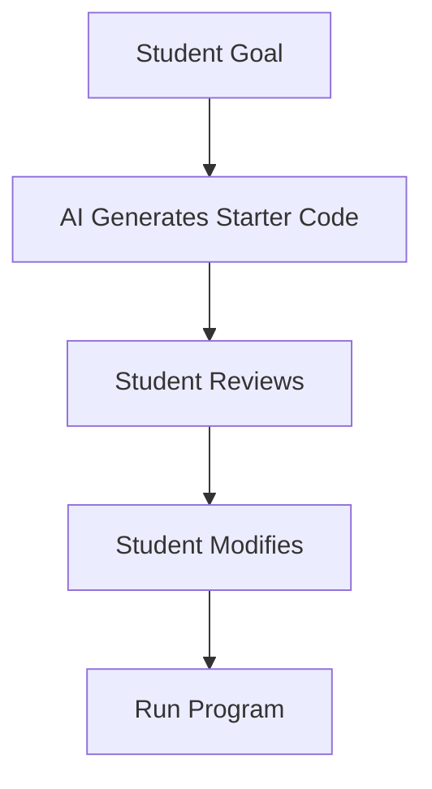

------

# **Important Teaching Insight**

Professional developers rarely write everything from scratch anymore.

Instead, they:

- Reuse libraries
- Use templates
- Collaborate with AI
- Integrate existing tools

Students should learn:

“Understanding and improving code”
 is often more important than typing every line manually.

------

# **3.4 Unit Testing**

Unit testing checks:

“Does this small piece of code work correctly?”

Example:

- Testing whether a calculator’s addition function works

------

# **Unit Testing Visualization**

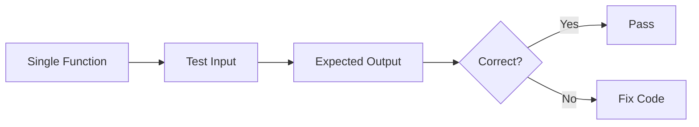

------

# **Example**

Function:

```python
def add(a, b):
    return a + b
```

Test:

```python
assert add(2,3) == 5
```

------

# **Teaching Opportunity**

Students learn:

- Verification
- Precision
- Debugging mindset
- Scientific thinking

------

# **AI + Unit Testing**

AI tools can:

- Generate tests automatically
- Explain failures
- Suggest edge cases

BUT:
 Students still must verify:

- Are the tests meaningful?
- Did AI miss important cases?

------

# **3.5 QA (Quality Assurance) Testing**

QA testing checks:

“Does the ENTIRE application work correctly?”

This includes:

- Clicking buttons
- Testing workflows
- Checking user experience
- Trying unusual inputs

------

# **QA Testing Workflow**

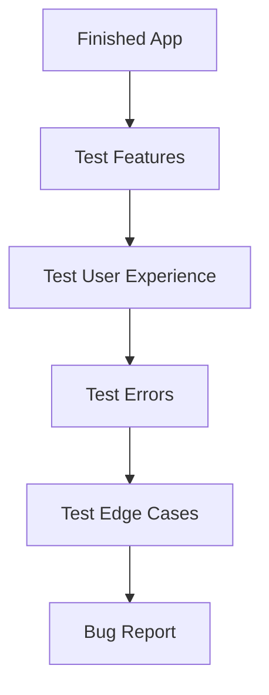

------

# **Real-World Example**

Students might test:

- Wrong passwords
- Missing fields
- Invalid inputs
- Broken links
- Mobile layouts

------

# **Important Distinction**

| **Unit Testing**        | **QA Testing**         |
| ----------------------- | ---------------------- |
| Tests small code pieces | Tests the whole system |
| Usually automated       | Often human-centered   |
| Developer focused       | User focused           |

------

# **3.6 Deployment**

Deployment means:

Making software available to real users.

Examples:

- Publishing a website
- Uploading an app
- Releasing software updates

------

# **Deployment Pipeline**

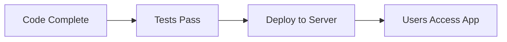

------

# **Beginner-Friendly Explanation**

Deployment is like:

“Moving a project from the classroom to the real world.”

------

# **AI’s Role in Deployment**

AI tools can help students:

- Configure hosting
- Generate deployment scripts
- Debug deployment errors
- Automate cloud setup

------

# **3.7 Monitoring & Maintenance**

Professional software is NEVER truly “finished.”

Teams monitor:

- Errors
- Performance
- User feedback
- Security issues

------

# **Monitoring Cycle**

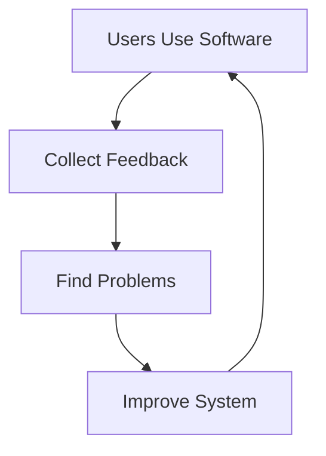

------

# **Classroom Translation**

Students should learn:

- Software evolves over time
- Real systems require updates
- Bugs are normal
- Improvement is continuous

------

# **Connecting AI Tools to the SDLC**

| **SDLC Phase** | **How AI Helps**             |
| -------------- | ---------------------------- |
| Requirements   | Brainstorming ideas          |
| Design         | Generating mockups and plans |
| Development    | Writing starter code         |
| Unit Testing   | Creating test cases          |
| QA Testing     | Finding bugs                 |
| Deployment     | Automating setup             |
| Monitoring     | Analyzing logs/errors        |

------

# **Key Message for Educators**

The most important takeaway is:

Coding is only ONE part of software development.

Modern software engineering also includes:

- Communication
- Planning
- Testing
- Deployment
- Continuous improvement

AI tools amplify all of these stages, not just coding itself.

------

# **Suggested Classroom Discussion**

Ask students:

1. Where can AI help most in the SDLC?
2. Where is human judgment still essential?
3. What risks exist if teams rely too heavily on AI?

This helps students understand:

- Technology
- Collaboration
- Responsibility
- Real-world engineering practices


___


# **Adding a Complete Example: Building** **`fibonacci(n)`** **Through the SDLC**

One of the best ways to help educators understand software engineering concepts is to walk through a very small real-world example from beginning to end.

This section demonstrates how a simple function:

```python
fibonacci(n)
```

can move through the entire Software Development Lifecycle (SDLC).

Even though Fibonacci is mathematically simple, it demonstrates:

- Requirements gathering
- Design thinking
- AI-assisted coding
- Testing
- Debugging
- Deployment concepts
- Monitoring/improvement

------

# **Example Scenario**

Imagine students are building:

“A math helper application for middle school students.”

One feature request is:

“Show the nth Fibonacci number.”

------

# **1. Business Requirement Understanding**

Before coding begins, teams clarify:

- What users need
- What the feature should do
- What success looks like

------

# **Example Requirement Discussion**

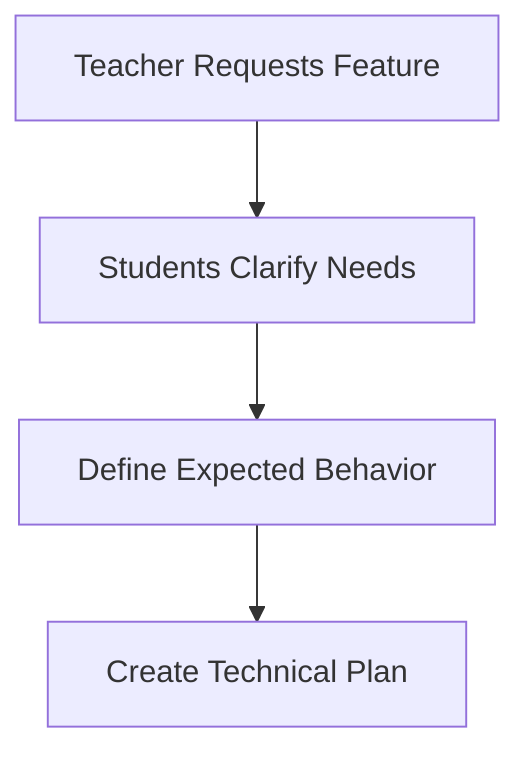

------

# **Teacher-Friendly Translation**

Instead of immediately coding:

```python
fibonacci(n)
```

students first ask:

- What is Fibonacci?
- What should happen if `n = 0`?
- Should negative numbers be allowed?
- How fast should the program run?

This teaches:

- Critical thinking
- Communication
- Problem analysis

------

# **Example Business Requirement**

“The system should return the nth Fibonacci number for non-negative integers.”

------

# **2. Design Phase**

Now students plan BEFORE coding.

------

# **Fibonacci Sequence Visualization**


------

# **Algorithm Design Thinking**

Students explore:

- Recursion
- Loops
- Efficiency
- Memory usage

------

# **Design Comparison**

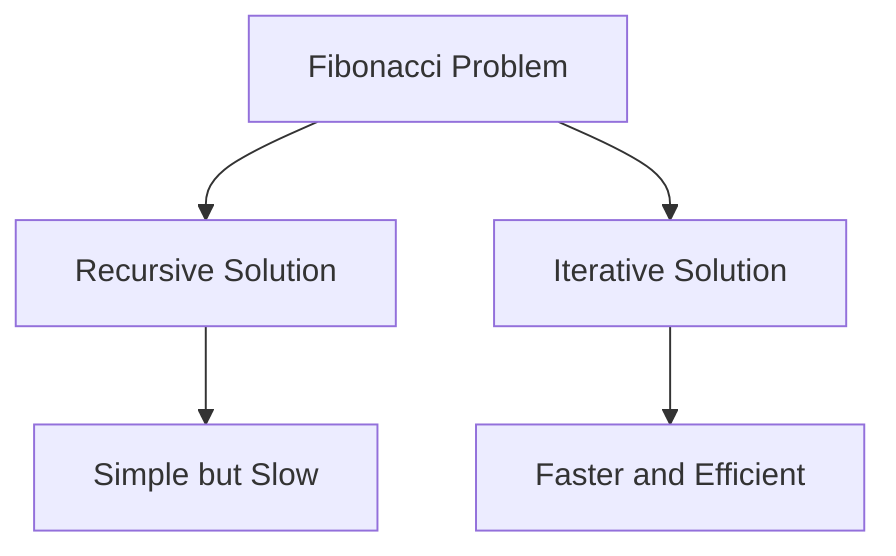

This helps educators explain:

Software engineering often involves choosing BETWEEN solutions.

------

# **3. Development Phase**

Now students begin coding.

This is where AI-assisted coding tools become valuable.

------

# **Example AI Prompt**

“Create a beginner-friendly Python function that returns the nth Fibonacci number using iteration.”

------

# **AI-Generated Starter Code**

```python
def fibonacci(n):
    if n < 0:
        raise ValueError("n must be non-negative")

    if n == 0:
        return 0

    if n == 1:
        return 1

    a, b = 0, 1

    for _ in range(2, n + 1):
        a, b = b, a + b

    return b
```

------

# **Modern AI-Assisted Development Workflow**

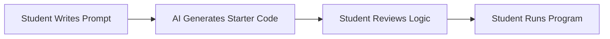

------

# **Important Teaching Point**

Students should NOT simply copy the AI output.

Instead they should ask:

- Why does this work?
- Why use iteration?
- What does `a, b = b, a + b` mean?
- Could there be bugs?

------

# **4. Unit Testing**

Now students verify small pieces of functionality.

------

# **Unit Testing Workflow**

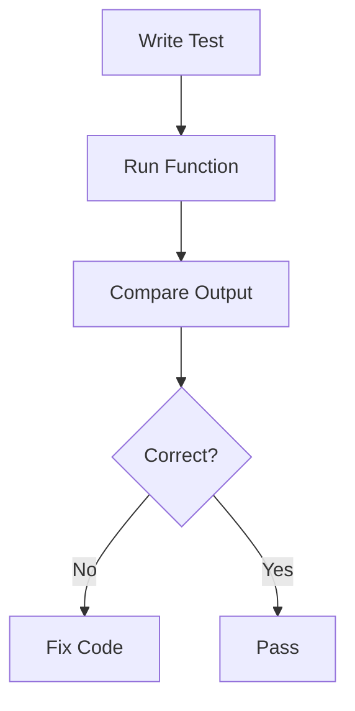

------

# **Example Unit Tests**

```python
assert fibonacci(0) == 0
assert fibonacci(1) == 1
assert fibonacci(5) == 5
assert fibonacci(10) == 55
```

------

# **Teaching Insight**

Students learn:

- Verification
- Edge cases
- Precision
- Confidence in software quality

------

# **AI + Testing**

AI tools can help generate:

- Test cases
- Edge cases
- Explanations of failures

Example prompt:

“Generate unit tests for this Fibonacci function.”

------

# **5. QA Testing**

Unit tests check small pieces.

QA testing checks:

“Does the WHOLE user experience work?”

------

# **Example QA Questions**

Students test:

- What happens with negative numbers?
- Does the app crash?
- Is the error message understandable?
- Does the UI respond correctly?

------

# **QA Workflow**

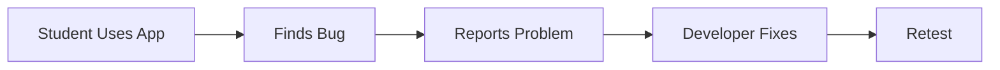

------

# **Example QA Scenario**

Input:

```python
fibonacci(-1)
```

Expected behavior:

- Clear error message
- No application crash

------

# **6. Deployment**

Now the software is shared with users.

For classroom projects this could mean:

- Running on a school website
- Sharing through GitHub
- Hosting on a cloud service

------

# **Simple Deployment Pipeline**

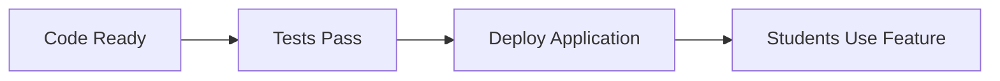

------

# **Example Real-World Translation**

The Fibonacci feature might become:

- Part of a math learning app
- A tutoring website
- A classroom coding project

This helps educators connect:

Tiny coding examples → real software systems.

------

# **7. Monitoring & Improvement**

Real software evolves continuously.

------

# **Monitoring Questions**

After deployment:

- Are students confused?
- Is the feature too slow?
- Are errors occurring?
- Are users entering invalid inputs?

------

# **Monitoring Loop**

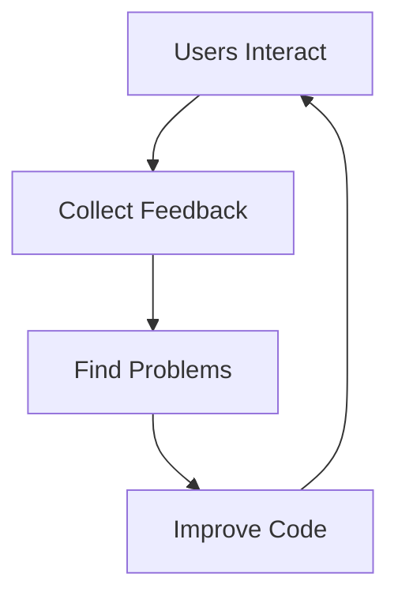

------

# **Example Improvement**

Students may later optimize Fibonacci using:

- Memorization
- Dynamic programming
- Caching

This introduces:

- Performance engineering
- Scalability
- Optimization thinking

------

# **Connecting AI Tools to the Fibonacci Example**

| **SDLC Stage** | **AI-Assisted Activity**       |
| -------------- | ------------------------------ |
| Requirements   | Brainstorm feature behavior    |
| Design         | Compare recursive vs iterative |
| Development    | Generate starter function      |
| Unit Testing   | Generate test cases            |
| QA Testing     | Simulate invalid inputs        |
| Deployment     | Generate hosting instructions  |
| Monitoring     | Analyze error logs             |

------

# **Complete SDLC Overview Using Fibonacci**


------

# **Key Teaching Insight for Educators**

Even a tiny coding example like Fibonacci demonstrates:

- Problem solving
- Engineering thinking
- Testing
- Iteration
- Human-AI collaboration

This helps educators understand:

Modern software engineering is a PROCESS, not just typing code.

------

# **Suggested Reflection Questions for Students**

1. What parts did AI help with most?
2. What mistakes could AI make here?
3. Why are tests important?
4. Which Fibonacci solution is better and why?
5. How would this scale in a larger application?

------

# **Final Educator Takeaway**

Using a small example like `fibonacci(n)` makes the SDLC approachable because educators can see:

- How ideas become software
- How AI supports each phase
- Why testing matters
- Why software evolves over time

The goal is not to turn every student into a professional software engineer.

The goal is to teach:

- Structured thinking
- Problem solving
- Verification
- Responsible AI collaboration
- Modern digital literacy


_____


# **Coding Before AI vs Coding With AI**

## **A Historical Parallel: The Calculator in Math Education**

One of the most effective ways to help educators understand AI-assisted coding is to compare it with a major shift that already happened in education:

# **The Introduction of Calculators in Mathematics**

When calculators first entered classrooms, many educators worried:

- “Students will stop learning math.”
- “Students will become dependent.”
- “Mental calculation skills will disappear.”
- “This is cheating.”

Very similar concerns now appear around AI coding tools.

------

# **Historical Parallel**

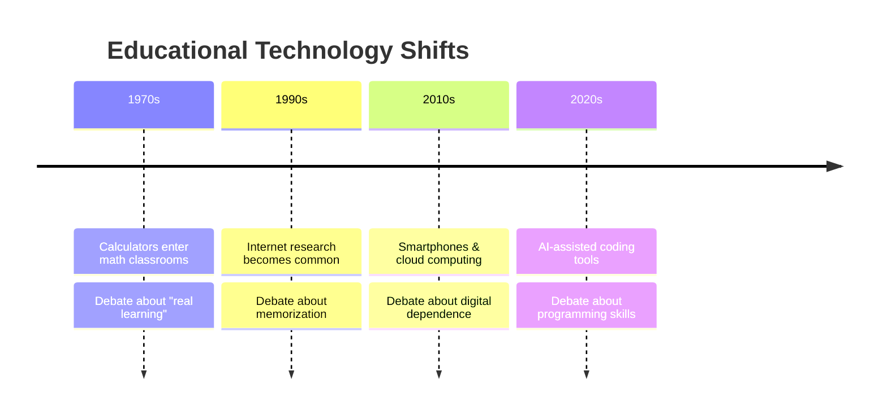

------

# **The Core Educational Shift**

## **Before Calculators**

Students spent enormous time on:

- Manual arithmetic
- Long division
- Repetitive calculations
- Computational mechanics

------

## **After Calculators**

Education shifted toward:

- Problem solving
- Modeling
- Reasoning
- Applied mathematics
- Real-world scenarios

------

# **The Same Shift is Happening in Coding**

## **Before AI Coding Tools**

Students spent enormous time on:

- Syntax memorization
- Typing boilerplate code
- Searching documentation
- Debugging tiny syntax errors

------

## **With AI Coding Tools**

Students can focus more on:

- Computational thinking
- System design
- Problem decomposition
- Testing
- Verification
- Creativity
- Software architecture

------

# **Educational Comparison**

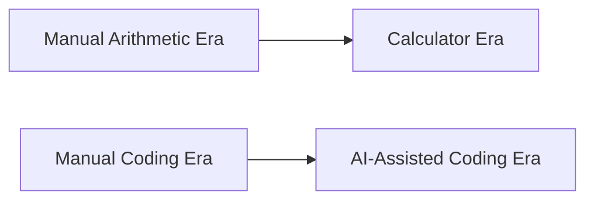

------

# **Teacher-Friendly Analogy**

| **Math Education**               | **Coding Education**                 |
| -------------------------------- | ------------------------------------ |
| Calculator assists computation   | AI assists code generation           |
| Student still solves the problem | Student still designs the solution   |
| Calculator can be misused        | AI can be misused                    |
| Understanding still matters      | Computational thinking still matters |
| Verification remains essential   | Testing remains essential            |

------

# **The Most Important Insight**

Calculators did NOT eliminate the need for mathematical understanding.

Similarly:

AI coding tools do NOT eliminate the need for computational thinking.

Instead, they shift emphasis toward:

- Higher-order thinking
- Evaluation
- Interpretation
- Strategy
- Design

------

# **Visualizing the Shift**

## **Traditional Coding Classroom**

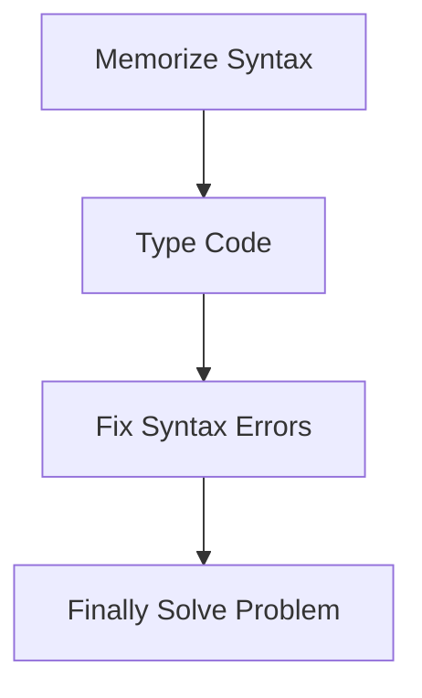

Students often became stuck before reaching:

actual problem solving.

------

# **AI-Assisted Coding Classroom**

```mermaid
flowchart TD
    A[Define Problem]
    --> B[AI Generates Starter Code]
    --> C[Student Evaluates]
    --> D[Test & Improve]
    --> E[Discuss Design Choices]
```

This shifts classroom time toward:

- reasoning
- discussion
- engineering practices
- collaboration

------

# **The Calculator Milestone in Math Education**

Eventually, math education evolved into:

- “When should calculators be used?”
   instead of:
- “Should calculators exist?”

Coding education is entering the same phase.

The modern question becomes:

“How do we teach students to use AI responsibly and effectively?”

—not:

“Can we stop AI from existing?”

------

# **Important Distinction for Educators**

## **Calculators automate arithmetic.**

## **AI coding tools automate:**

- syntax generation
- boilerplate code
- documentation lookup
- repetitive debugging

BUT they do NOT automatically provide:

- good software design
- critical thinking
- user understanding
- ethical reasoning
- testing judgment

Humans still provide these.

------

# **Human + AI Collaboration Model**

```mermaid
flowchart LR
    A[Human Problem Solving]
    --> B[AI Assistance]
    --> C[Human Verification]
    --> D[Human Decisions]
```

This is now the dominant industry workflow.

------

# **Real Industry Comparison**

## **Earlier Software Development**

```mermaid
flowchart TD
    A[Write Everything Manually]
    --> B[Search Documentation]
    --> C[Debug Manually]
    --> D[Build Slowly]
```

------

## **Modern Software Development**

```mermaid
flowchart TD
    A[Describe Intent]
    --> B[AI Generates Scaffold]
    --> C[Engineer Refines]
    --> D[Test & Validate]
    --> E[Deploy Faster]
```

------

# **Important Educational Opportunity**

AI tools allow beginner students to:

- Build larger projects earlier
- Experiment more creatively
- Focus on system behavior
- Experience authentic software engineering workflows

Much like calculators enabled:

- More advanced applied math earlier in education.

------

# **Common Educator Concerns**

## **“Will students stop learning coding fundamentals?”**

This mirrors:

“Will students stop learning arithmetic?”

The answer in both cases is:

- Fundamentals still matter
- Understanding still matters
- Verification still matters

But education evolves upward.

------

# **Bloom’s Taxonomy Shift**

AI-assisted coding shifts learning upward in Bloom’s Taxonomy.

```mermaid
flowchart TD
    A[Create & Design]
    --> B[Evaluate]
    --> C[Analyze]
    --> D[Apply]
    --> E[Understand]
    --> F[Remember Syntax]

    style A font-size:20px
    style B font-size:18px
    style C font-size:16px
```


Without AI, many classrooms get trapped at:

- memorization
- syntax correction

With AI, students can spend more time:

- designing
- evaluating
- creating


```mermaid
flowchart BT
    F[Remember Syntax]
    --> E[Understand Concepts]
    --> D[Apply Knowledge]
    --> C[Analyze Systems]
    --> B[Evaluate Solutions]
    --> A[Create & Design]

    style A font-size:20px
    style B font-size:18px
    style C font-size:16px
```

Without AI tools, many beginner coding classrooms spend most instructional time at the lower levels of Bloom’s Taxonomy:

- Remembering syntax
- Fixing formatting
- Correcting small coding mistakes

AI-assisted coding can help shift more classroom time toward higher-order thinking skills such as:

- Analyzing solutions
- Evaluating tradeoffs
- Designing systems
- Creating applications
- Reflecting on software behavior

The educational opportunity is not to remove foundational learning, but to reduce repetitive mechanical barriers so students can engage more deeply in computational thinking and software engineering practices.

------

# **Example Using Fibonacci**

Without AI:
 Students may spend most time:

- remembering loop syntax
- fixing indentation
- debugging variable errors

With AI:
 Students can spend more time discussing:

- recursion vs iteration
- efficiency
- scalability
- testing strategies
- algorithm design

------

# **Example Educational Progression**

```mermaid
flowchart LR
    A[Learn Basic Syntax]
    --> B[Use AI Assistance]
    --> C[Focus on Design]
    --> D[Build Real Applications]
    --> E[Learn Engineering Practices]
```

------

# **Key Message for Educators**

The goal of AI-assisted coding education is NOT:

replacing learning.

It is:

reducing unnecessary mechanical friction so students can focus on deeper thinking.

Exactly like calculators did for mathematics.

------

# **Suggested Classroom Discussion**

Ask students:

1. What coding tasks should AI automate?
2. What thinking should humans always do?
3. How is AI similar to calculators?
4. How is AI different from calculators?
5. What risks exist if students trust AI blindly?

------

# **Final Educator Takeaway**

Calculators transformed math education from:

- repetitive arithmetic
   to:
- analytical problem solving

AI coding tools are transforming programming education from:

- syntax-heavy instruction
   to:
- engineering, reasoning, and design-focused learning

The future of coding education is likely not:

“coding without AI”

but rather:

“learning how to think, build, verify, and collaborate effectively with AI.”


____


# **Research Update: What Studies Say About AI Coding Productivity**

As educators introduce AI-assisted coding into classrooms, it is important to understand:

AI tools do not automatically make every programmer faster.

Recent research shows a more nuanced picture.

One of the most discussed studies comes from METR (Model Evaluation & Threat Research), which examined how experienced open-source developers used AI coding tools in realistic software engineering tasks.  

------

# **Why This Matters for Educators**

Many headlines claim:

“AI makes developers dramatically more productive.”

However, classroom reality — like industry reality — is more complicated.

This is actually GOOD news educationally because it reinforces a critical principle:

AI should support thinking, not replace thinking.

------

# **The METR Study (2025)**

Researchers conducted a randomized controlled trial involving:

- 16 experienced open-source developers
- 246 real-world software tasks
- Large mature codebases
- Developers already familiar with their projects

Developers primarily used:

- Cursor Pro
- Claude 3.5 / 3.7 Sonnet
- Modern AI coding assistants


https://metr.org/blog/2025-07-10-early-2025-ai-experienced-os-dev-study/


------

# **Surprising Result**

The study found:

```mermaid
flowchart LR
    A[Developers Expected Speedup]
    --> B[Actual Measured Result]

    B --> C[AI Users Took 19% Longer]
```

Experienced developers believed AI made them faster.

But measured results showed:

- Tasks actually took **19% longer** with AI tools.  

------

# **Why Did This Happen?**

Researchers identified several contributing factors.

------

# **AI Productivity Friction**

```mermaid
mindmap
  root((AI Productivity Challenges))
    Reviewing AI Output
    Fixing Incorrect Suggestions
    Waiting for Responses
    Prompt Engineering
    Context Limitations
    Large Codebase Complexity
```

------

# **Key Findings**

## **1. AI Helped with Small Tasks**

AI was useful for:

- Boilerplate code
- Documentation
- Repetitive patterns
- Idea generation

------

## **2. AI Struggled with Complex Context**

The experienced developers worked on:

- Large codebases
- Mature systems
- Complex architectures

AI often lacked:

- Project context
- Historical understanding
- Design intent

------

## **3. Developers Overestimated AI Benefits**

One fascinating finding:

- Developers believed AI improved productivity by ~20%
- Actual measured productivity decreased by ~19%

This teaches an important lesson:

Human perception of productivity is not always accurate.

------

# **Educational Insight**

This is VERY important for classrooms.

Students may FEEL:

- faster
- more productive
- more confident

But educators should still require:

- testing
- explanation
- reflection
- debugging
- verification

------

# **Human Oversight Still Matters**

```mermaid
flowchart LR
    A[AI Generates Code]
    --> B[Human Reviews]
    --> C[Human Tests]
    --> D[Human Decides]
```

The METR study reinforces:

AI is an assistant, not an autonomous engineer.

------

# **Important Nuance for Educators**

The study DOES NOT conclude:

“AI coding tools are bad.”

Instead, it suggests:

- effectiveness depends on context
- expertise level matters
- task type matters
- project complexity matters

------

# **Where AI Appears Most Helpful**

Research and classroom experience suggest AI tools may help more with:

```mermaid
flowchart TD
    A[Beginner Learning]
    --> B[Project Scaffolding]
    --> C[Brainstorming]
    --> D[Boilerplate Generation]
    --> E[Rapid Prototyping]
```

------

# **Where AI Struggles More**

```mermaid
flowchart TD
    A[Large Existing Systems]
    --> B[Complex Architecture]
    --> C[Deep Context]
    --> D[High Reliability Requirements]
```

------

# **Connection to Education**

This research aligns with a major teaching principle:

AI tools are most valuable when students:

- actively think
- evaluate outputs
- question suggestions
- verify correctness

—not when students passively accept generated code.

------

# **Educational Comparison**

| **Weak AI Usage**       | **Strong AI Usage**         |
| ----------------------- | --------------------------- |
| Copy-paste code blindly | Analyze generated solutions |
| Skip testing            | Verify outputs carefully    |
| Depend entirely on AI   | Use AI as a collaborator    |
| Focus only on speed     | Focus on understanding      |

------

# **AI + Bloom’s Taxonomy**

The study reinforces the importance of moving students toward higher-order thinking.

```mermaid
flowchart BT
    F[Remember Syntax]
    --> E[Understand Code]
    --> D[Apply Concepts]
    --> C[Analyze Systems]
    --> B[Evaluate AI Output]
    --> A[Create Solutions]
```

AI can help reduce low-level friction, but:

- evaluation
- analysis
- design
- reasoning

remain deeply human skills.

------

# **Key Takeaway for Educators**

The most important message from this research is:

AI tools do not eliminate the need for software engineering thinking.

Instead, they shift the role of learners toward:

- reviewers
- designers
- testers
- evaluators
- collaborators

------

# **Connecting This to the Calculator Analogy**

Calculators automated arithmetic.

AI coding tools automate:

- syntax generation
- code scaffolding
- repetitive coding tasks

But neither calculators nor AI remove the need for:

- reasoning
- verification
- conceptual understanding

------

# **Balanced Perspective for Schools**

Educators should avoid two extremes:

| **Extreme**            | **Problem**                    |
| ---------------------- | ------------------------------ |
| “AI solves everything” | Students stop thinking         |
| “Ban AI completely”    | Students miss modern workflows |

Instead:

Teach students how to collaborate responsibly with AI.

------

# **Recommended Classroom Message**

Tell students:

“AI can help you move faster, but it cannot replace your responsibility to understand, test, and improve what you build.”

------

# **Final Reflection Questions for Students**

1. Why might AI slow down expert developers?
2. When is AI most useful?
3. Why is testing still important?
4. What mistakes can AI introduce?
5. How should humans verify AI-generated code?

------

# **Final Educator Takeaway**

The METR study helps educators frame AI-assisted coding realistically:

- AI is powerful
- AI is useful
- AI is evolving rapidly

BUT:

- AI is imperfect
- AI requires oversight
- AI does not replace engineering judgment

The classroom opportunity is not:

“students using AI instead of thinking”

It is:

“students learning how to think critically while collaborating effectively with AI.”


____


# **Example: Prime Numbers and the Importance of Human Thinking**

One of the most important lessons educators can teach about AI-assisted coding is:

AI can generate working code quickly, but humans still provide the deeper engineering thinking.

This example demonstrates how:

- AI often produces a *correct but suboptimal* solution first
- Human reasoning improves efficiency and scalability
- Software engineering is about tradeoffs, not just correctness

------

# **Problem Statement**

“Find all prime numbers less than or equal to `n`.”

This is a great classroom example because:

- The naive solution works
- A better algorithm exists
- Students can compare efficiency
- AI tools often suggest the simpler version first

------

# **Step 1 — Typical AI Quick Suggestion**

A student might prompt:

“Write Python code to find all primes up to n.”

AI often generates something like this first:

```python
def is_prime(num):
    if num < 2:
        return False

    for i in range(2, int(num ** 0.5) + 1):
        if num % i == 0:
            return False

    return True


def find_primes(n):
    primes = []

    for num in range(2, n + 1):
        if is_prime(num):
            primes.append(num)

    return primes


print(find_primes(30))
```

------

# **Why This is Actually Good**

This solution is:

- Readable
- Beginner-friendly
- Correct
- Easy to explain

AI tools are VERY useful for generating this kind of starter solution quickly.

------

# **But Human Thinking Adds the Next Question**

An experienced engineer asks:

“Will this still work efficiently for very large values of n?”

This is where software engineering thinking becomes important.

------

# **Human Engineering Thinking**

```mermaid
flowchart TD
    A[AI Generates Working Code]
    --> B[Human Reviews Performance]
    --> C[Human Asks About Scalability]
    --> D[Better Algorithm Selected]
```

------

# **The Scalability Problem**

The earlier solution repeatedly checks divisibility for every number.

As `n` grows large:

- The program slows down significantly
- Repeated work increases
- Efficiency matters

------

# **Better Human-Guided Solution:**

# **Sieve of Eratosthenes**

A human with algorithm knowledge may choose a more efficient approach.

------

# **Visualizing the Sieve**

```mermaid
flowchart LR
    A[Start 2..n]
    --> B[Mark Multiples of 2]
    --> C[Mark Multiples of 3]
    --> D[Mark Multiples of 5]
    --> E[Remaining Numbers Are Prime]
```

------

# **Improved Algorithm**

```python
def sieve_of_eratosthenes(n):
    sieve = [True] * (n + 1)

    sieve[0] = sieve[1] = False

    for i in range(2, int(n ** 0.5) + 1):
        if sieve[i]:
            for multiple in range(i * i, n + 1, i):
                sieve[multiple] = False

    primes = []

    for i in range(2, n + 1):
        if sieve[i]:
            primes.append(i)

    return primes


print(sieve_of_eratosthenes(30))
```

------

# **Comparing the Two Solutions**

| **Approach**          | **Strength**      | **Weakness**       |
| --------------------- | ----------------- | ------------------ |
| Trial Division        | Simple & readable | Slower for large n |
| Sieve of Eratosthenes | Much faster       | More complex logic |

------

# **Important Educational Insight**

The key lesson is NOT:

“AI gave the wrong answer.”

The lesson is:

“AI gave a reasonable starting point, but human thinking improved the solution.”

------

# **AI vs Human Engineering Roles**

```mermaid
flowchart LR
    A[AI Generates Initial Code]
    --> B[Human Evaluates]
    --> C[Human Improves Algorithm]
    --> D[AI Assists Refinement]
```

This mirrors real-world software engineering.

------

# **Computational Thinking Opportunity**

Students can discuss:

- Which solution is easier to understand?
- Which is faster?
- Which uses more memory?
- Which is better for beginners?
- Which would scale to millions of numbers?

These are REAL engineering questions.

------

# **Classroom Discussion Idea**

Ask students:

## **If** **`n = 30`**

Both solutions work fine.

## **If** **`n = 10,000,000`**

Which solution becomes practical?

This helps students understand:

Correctness alone is not enough in software engineering.

Efficiency matters too.

------

# **Time Complexity Comparison**

Without overwhelming beginners, educators can introduce:

| **Algorithm**         | **Approximate Efficiency** |
| --------------------- | -------------------------- |
| Trial Division        | Slower growth              |
| Sieve of Eratosthenes | Much faster growth         |

------

# **Simple Performance Visualization**

```mermaid
flowchart TD
    A[Small Input Sizes]
    --> B[Both Solutions Feel Fast]

    B --> C[Large Input Sizes]

    C --> D[Naive Solution Slows Dramatically]
    C --> E[Sieve Remains Efficient]
```

------

# **AI Productivity Lesson**

AI tools are excellent at:

- Generating starter code
- Producing common patterns
- Accelerating implementation

BUT:

- AI may not optimize automatically
- AI may not choose the best algorithm
- AI may not understand long-term scalability needs

Humans still provide:

- algorithmic insight
- architecture thinking
- optimization reasoning
- performance tradeoff decisions

------

# **Connection to the Calculator Analogy**

This is similar to calculators in mathematics.

A calculator can:

- compute quickly

But humans still decide:

- which formula to use
- which model applies
- whether the result makes sense

Similarly:

AI can generate code quickly.

Humans still decide:

- which algorithm is appropriate
- whether the implementation scales
- whether the design is maintainable

------

# **Bloom’s Taxonomy Connection**

Without AI:
 Students may spend all their time:

- fixing syntax
- typing loops
- debugging indentation

With AI:
 Students can spend more time:

- comparing algorithms
- analyzing performance
- evaluating tradeoffs
- designing better solutions

------

# **Bloom’s Taxonomy Shift**

```mermaid
flowchart BT
    F[Write Syntax]
    --> E[Understand Logic]
    --> D[Apply Algorithms]
    --> C[Analyze Performance]
    --> B[Evaluate Tradeoffs]
    --> A[Design Better Solutions]
```

------

# **Suggested Student Reflection Questions**

1. Why might AI generate the simpler solution first?
2. What makes the sieve algorithm faster?
3. Which solution is easier to teach beginners?
4. How do engineers choose between readability and performance?
5. What role should AI play in algorithm design?

------

# **Key Educator Takeaway**

This example demonstrates one of the most important ideas in AI-assisted coding education:

AI accelerates implementation, but human thinking drives engineering quality.

Students still need:

- computational thinking
- algorithmic reasoning
- performance awareness
- testing discipline
- design judgment

AI changes HOW students build software.

It does not eliminate the need to THINK deeply about software.


____


# **Deep Dive: Comparing the Two Prime Number Approaches**

This section helps educators understand a critical software engineering idea:

Two programs can both be CORRECT — but one can still be dramatically BETTER.

This is one of the most important concepts students learn in computer science:

- correctness
- efficiency
- scalability
- tradeoffs

AI coding tools often generate:

- the *first correct solution*

Human engineers often improve:

- performance
- scalability
- maintainability

------

# **The Problem**

Find all prime numbers less than or equal to `n`.

We will compare:

1. **Trial Division Approach**
2. **Sieve of Eratosthenes**

------

# **Approach 1 — Trial Division**

## **Idea**

Check every number individually.

For each number:

- test whether it can be divided by smaller numbers

------

# **Trial Division Visualization**

```mermaid
flowchart TD
    A[Check Number]
    --> B[Test Divisibility]
    --> C{Divisible?}

    C -->|Yes| D[Not Prime]
    C -->|No| E[Prime]
```

------

# **Example Code**

```python
def is_prime(num):
    if num < 2:
        return False

    for i in range(2, int(num ** 0.5) + 1):
        if num % i == 0:
            return False

    return True


def find_primes(n):
    primes = []

    for num in range(2, n + 1):
        if is_prime(num):
            primes.append(num)

    return primes
```

------

# **Why AI Often Suggests This First**

AI models frequently generate this solution because:

- easy to explain
- common in tutorials
- beginner-friendly
- readable

This is GOOD for learning.

But engineering thinking asks:

“Will this scale?”

------

# **Time Complexity**

The approximate complexity is:

O(n\sqrt{n})

Meaning:

- as `n` grows
- the work grows very quickly

------

# **Teacher-Friendly Explanation**

If:

- `n = 100`
   → works instantly

If:

- `n = 10,000`
   → still manageable

If:

- `n = 10,000,000`
   → becomes significantly slower

------

# **What the Computer is Actually Doing**

For many numbers, the program repeatedly asks:

```text
Is this divisible by 2?
Is this divisible by 3?
Is this divisible by 5?
...
```

over and over again.

This repeated checking becomes expensive.

------

# **Estimated Running Time on a Modern Teacher Laptop**

Typical teacher computer:

- Modern Intel i5 / Ryzen 5
- 8–16GB RAM
- Python installed locally

Approximate times:

| **n**      | **Trial Division Time** |
| ---------- | ----------------------- |
| 1,000      | < 0.01 sec              |
| 10,000     | ~0.05 sec               |
| 100,000    | ~0.5–1 sec              |
| 1,000,000  | Several seconds         |
| 10,000,000 | Potentially minutes     |

These are rough educational estimates, not benchmark guarantees.

------

# **Educational Insight**

Students may initially think:

“The program works, so we are done.”

But software engineering asks:

- Is it efficient?
- Is it scalable?
- Is there unnecessary repeated work?

------

# **Approach 2 — Sieve of Eratosthenes**

Instead of checking each number repeatedly, the sieve:

Eliminates non-prime numbers systematically.

------

# **Sieve Visualization**

```mermaid
flowchart LR
    A[Numbers 2..n]
    --> B[Remove Multiples of 2]
    --> C[Remove Multiples of 3]
    --> D[Remove Multiples of 5]
    --> E[Remaining Numbers Are Prime]
```

------

# **Example Code**

```python
def sieve_of_eratosthenes(n):
    sieve = [True] * (n + 1)

    sieve[0] = sieve[1] = False

    for i in range(2, int(n ** 0.5) + 1):
        if sieve[i]:
            for multiple in range(i * i, n + 1, i):
                sieve[multiple] = False

    return [i for i in range(2, n + 1) if sieve[i]]
```

------

# **Human Engineering Insight**

The key optimization idea is:

Instead of repeatedly testing divisibility, mark known composites once.

This dramatically reduces repeated work.

------

# **Time Complexity**

The sieve runs approximately in:

O(n \log\log n)

This is MUCH more efficient for large inputs.

------

# **Teacher-Friendly Interpretation**

Even though:

- the formula looks more complicated

the important idea is:

growth is much slower as `n` becomes large.

------

# **Estimated Running Time on a Modern Teacher Laptop**

| **n**      | **Sieve Running Time** |
| ---------- | ---------------------- |
| 1,000      | < 0.01 sec             |
| 10,000     | < 0.01 sec             |
| 100,000    | ~0.02 sec              |
| 1,000,000  | ~0.1–0.3 sec           |
| 10,000,000 | ~1–3 sec               |

Again, these are approximate classroom-scale estimates.

------

# **Side-by-Side Comparison**

| **Feature**              | **Trial Division** | **Sieve of Eratosthenes** |
| ------------------------ | ------------------ | ------------------------- |
| Simplicity               | Easier             | More advanced             |
| Readability              | High               | Moderate                  |
| Beginner Friendly        | Yes                | Medium                    |
| Scalability              | Poorer             | Excellent                 |
| Repeated Work            | High               | Low                       |
| AI Often Suggests First? | Yes                | Sometimes                 |

------

# **Visual Comparison of Growth**

```mermaid
flowchart TD
    A[Small Inputs]
    --> B[Both Feel Fast]

    B --> C[Large Inputs]

    C --> D[Trial Division Slows Dramatically]
    C --> E[Sieve Remains Fast]
```

------

# **The Big Educational Lesson**

This example demonstrates:

## **AI Strength**

AI rapidly generates:

- working code
- beginner-friendly solutions
- useful starting points

------

## **Human Strength**

Humans contribute:

- algorithmic insight
- optimization thinking
- scalability awareness
- engineering judgment

------

# **Real Industry Parallel**

This is VERY realistic professionally.

Junior developers or AI tools often produce:

“a correct implementation.”

Senior engineers often ask:

- Will this scale?
- What happens with millions of users?
- Can memory usage improve?
- Is there a better algorithm?

------

# **Engineering Thinking Workflow**

```mermaid
flowchart LR
    A[AI Generates Solution]
    --> B[Human Reviews]
    --> C[Human Identifies Bottleneck]
    --> D[Better Algorithm Selected]
    --> E[AI Helps Refine Implementation]
```

------

# **Computational Thinking Skills Students Practice**

| **Skill**            | **Example**                   |
| -------------------- | ----------------------------- |
| Analysis             | Compare algorithms            |
| Evaluation           | Judge performance             |
| Optimization         | Reduce repeated work          |
| Tradeoff Reasoning   | Simplicity vs speed           |
| Scalability Thinking | What happens for huge inputs? |

------

# **Bloom’s Taxonomy Connection**

Without AI:
 students may spend most time:

- fixing syntax
- debugging loops
- correcting formatting

With AI:
 students can spend more time:

- analyzing algorithms
- comparing approaches
- evaluating tradeoffs
- discussing scalability

------

# **Bloom’s Shift for This Example**

```mermaid
flowchart BT
    F[Write Syntax]
    --> E[Understand Prime Logic]
    --> D[Apply Algorithms]
    --> C[Analyze Complexity]
    --> B[Evaluate Tradeoffs]
    --> A[Design Efficient Systems]
```

------

# **Key Takeaway for Educators**

This example powerfully demonstrates:

AI can accelerate coding.

But:

- human reasoning
- computational thinking
- algorithm selection
- engineering judgment

remain essential.

The educational opportunity is NOT:

replacing thinking with AI

It is:

using AI to move students more quickly toward deeper engineering thinking.